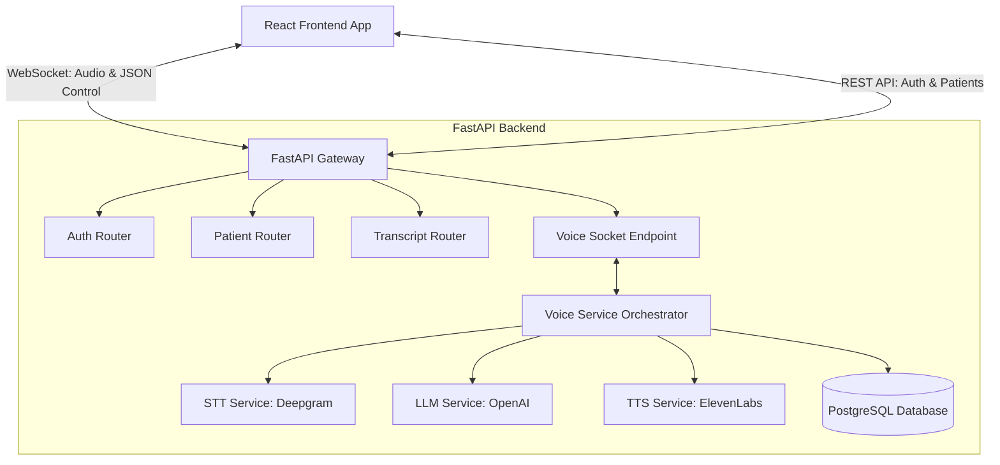

# 2Care AI - Realtime Multilingual Healthcare Voice AI System

A production-ready, scalable architecture for a real-time, multilingual healthcare voice AI system. This system allows clinicians to stream patient interactions in real-time, auto-detect and translate multilingual dialogue, and compile structured clinical SOAP notes upon session completion.

---

## 🏗️ Project Architecture Overview

This project is organized as a monorepo containing a modular **FastAPI** backend and a responsive **React + Vite + TypeScript** frontend console.



---

## 📁 Repository Directory Structure

```text
2-care-ai/
├── backend/                  # FastAPI Application
│   ├── app/
│   │   ├── api/              # API Controllers & Routers
│   │   │   ├── deps.py       # Authentication & DB Injection Dependencies
│   │   │   └── v1/           # API Versioning Router
│   │   │       ├── endpoints/
│   │   │       │   ├── auth.py        # Clinician profile management & Login
│   │   │       │   ├── patients.py    # Patients database CRUD
│   │   │       │   ├── transcripts.py # Consultation summaries & transcripts
│   │   │       │   └── voice.py       # Realtime WebSocket stream handler
│   │   │       └── router.py          # Unified V1 Router
│   │   ├── core/             # Base settings & configs
│   │   │   ├── config.py     # Pydantic Settings validator
│   │   │   ├── database.py   # Async SQLAlchemy connections
│   │   │   ├── logging.py    # Standardized system logs formatter
│   │   │   └── security.py   # JWT & encryption helper functions
│   │   ├── models/           # DB Schema Declarations (SQLAlchemy 2.0)
│   │   │   ├── patient.py
│   │   │   ├── transcript.py
│   │   │   └── user.py
│   │   ├── schemas/          # Data Validation & Serialization (Pydantic V2)
│   │   │   ├── auth.py
│   │   │   ├── patient.py
│   │   │   ├── transcript.py
│   │   │   └── voice.py
│   │   ├── services/         # Business Logic Layer (External APIs and SQL logic)
│   │   │   ├── base.py       # Generic CRUD helper class
│   │   │   ├── llm_service.py# Reasoning, Translations & SOAPs Summaries
│   │   │   ├── patient_service.py # Database operations for patient records
│   │   │   ├── stt_service.py# Speech-to-Text translation streams
│   │   │   ├── tts_service.py# Text-to-Speech audio synthesizer
│   │   │   └── voice_service.py   # Call manager orchestrator
│   │   └── main.py           # Lifespan managers & middlewares
│   ├── .env.example
│   ├── Dockerfile
│   └── requirements.txt
│
├── frontend/                 # React Application (Vite + TypeScript)
│   ├── src/
│   │   ├── assets/           # Logos and structural assets
│   │   ├── components/       # Presentational layout blocks
│   │   │   └── voice/
│   │   │       └── VoiceVisualizer.tsx # Waveform canvas animation
│   │   ├── features/         # Feature modules
│   │   │   └── voice/
│   │   │       └── hooks/
│   │   │           └── useVoiceWebSocket.ts # Audio streaming hook
│   │   ├── services/         # API wrappers
│   │   │   ├── apiClient.ts  # Typed fetch client with auth token headers
│   │   │   └── websocketClient.ts # Event-driven WebSocket client wrapper
│   │   ├── types/            # App typescript declarations
│   │   │   └── index.ts
│   │   ├── utils/            # Shared helper functions
│   │   │   └── audio.ts      # Downsampling & Int16 PCM converters
│   │   ├── App.tsx           # Interactive Clinician Console dashboard
│   │   ├── index.css         # Custom dark-theme styling sheet
│   │   └── main.tsx          # Virtual DOM app renderer
│   ├── .env.example
│   ├── Dockerfile
│   ├── nginx.conf            # SPA routing rules for production
│   └── package.json
│
├── docker-compose.yml        # Multi-container local orchestra
└── .gitignore                # Global git ignore configurations
```

---

## ⚡ Quick Start (Dockerized Development)

Launch the database, FastAPI, and React frontend simultaneously using Docker Compose:

1. **Configure Environment Variables:**
   Create a local env file for the backend if you have specific service tokens:
   ```bash
   cp backend/.env.example backend/.env
   ```

2. **Run Containers:**
   ```bash
   docker compose up --build
   ```

3. **Access Services:**
   - **Frontend Console:** `http://localhost:5173`
   - **FastAPI API Documentation:** `http://localhost:8000/docs`
   - **PostgreSQL Database:** `localhost:5432`

---

## 💻 Manual Setup & Testing

Refer to the respective README files in the [backend](file:///Users/tisha/2-care-ai/backend/README.md) and [frontend](file:///Users/tisha/2-care-ai/frontend/README.md) subdirectories for detailed step-by-step instructions on setting up localized Python virtual environments or NPM packages.
